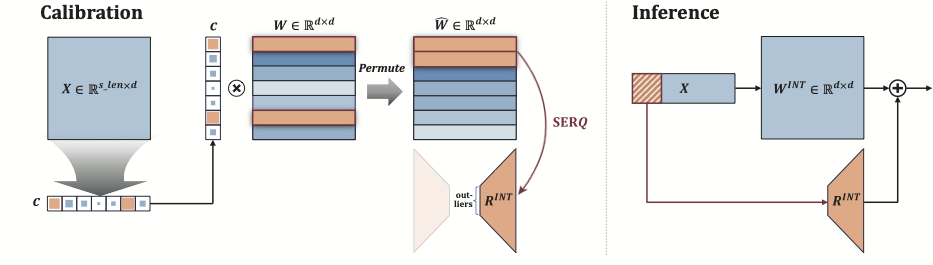

# SERQ : Saliency-aware Low-rank Error Reconstruction for LLM Quantization

## 📌 Abstract
Post-training quantization (PTQ) has emerged as a prevailing technique for de-
ploying large language models (LLMs) efficiently in terms of both memory and
computation, across edge devices and server platforms. Existing PTQ methods
primarily aim to reduce precision in weights and activations by mitigating quan-
tization errors caused by channel-wise outlier activations (e.g., pre-quantization
scaling, online transformations, or low-rank error reconstruction). Among these
approaches, error reconstruction with low-rank adaptation (LoRA) has proven par-
ticularly effective, as it introduces a lightweight auxiliary computation path with-
out requiring heavy optimization or additional online layers. However, prior stud-
ies reveal severe accuracy degradation under W4A4 settings, and conventional
low-rank adaptations rely on two sequential factors, necessitating intermediate
quantization during inference and thereby limiting low-precision efficiency. In this
work, we propose SERQ, a saliency-aware error reconstruction method for low-
bit LLM inference that employs a single low-rank compensation matrix. SERQ
preserves efficient 4-bit matrix multiplication in linear layers by jointly mitigating
quantization errors arising from both activation and weight saliency through three
stages: (1) static activation flattening, (2) saliency-aware error reconstruction, and
(3) offline weight permutation. The method incurs additional computation only
for low-rank error reconstruction via a single decomposition, while all other oper-
ations are performed offline, thereby keeping latency overhead minimal. Empir-
ically, SERQ outperforms prior error reconstruction methods under both W4A8
and W4A4 settings, and achieves higher accuracy than state-of-the-art rotation-
based W4A4 approaches, while substantially reducing calibration complexity.

---

## 0) Environment (optional)

```
conda create -n serq python=3.11
conda activate serq
```

## 1) Requirement
```
pip3 install torch
pip install transformers==4.53.0
pip install tensorboard
pip install datasets
pip install accelerate
pip install lm-eval
```

## 2) Run

the below shows overall repository layout.
```
.
├─ modeling/
│  └─ ...                # include supported model architecture
├─ serq_quant/
│  ├─ int_cfg.py         # qphase, mxfp, and all quantization configuration
│  ├─ int_quant.py       # Linear layer which conduct the actual quantization
│  └─ observers.py       # modules for calibration
├─ utils/
│  ├─ data_utils.py
│  ├─ gptq_utils.py
│  └─ quant_utils.py
├─ models/               # stores calibration outputs / GPTQ checkpoints
├─ calibration.py
├─ run_gptq.py
├─ eval_ppl.py
└─ eval_0shot.py
```

When evaluating the model, the model behavior differs depending on the `qphase`.
+ qphase 1 : calibration mode
+ qphase 777 : mode for applying GPTQ
+ qphase 3 : evaluation mode
<br>

### ➡️ Calibration

This is a step to find activation distribution for 128 samples
```
python run_calib.py \
  --model_path meta-llama/Llama-2-7b-hf \
  --qphase 1
```
When the command above is executed, the model that has completed calibration is saved in the `models/` directory.

<br>

### ➡️ Apply GPTQ

We recommand applying the GPTQ method to further improve performance in weight quantization.
Especially, it is applied in a way that is compatible with our offline processing methods (e.g., Activation Flattening, Weight Permutation).
```
python run_gptq.py \
  --model_path ./models/<model-name> \
  --output_dir ./models/<name-to-save> \
  --w_bits 4 \
  --w_groupsize 128 \
  --qphase 777
```
When the command above is executed, the model that has completed GPTQ application is saved in the `models/` directory.

<br>

### ➡️ Evaluation

+ integer quantization
```
python eval_ppl.py \
  --model_path ./models/<gptq-model-name> \
  --qphase 3 \
  --qnw 4 \
  --qna 4 \
  --asym
```
```
python eval_0shot.py \
  --model_path ./models/<gptq-model-name> \
  --tasks mmlu \
  --qphase 3 \
  --qnw 4 \
  --qna 4 \
  --asym
```

+ mxfp4
```
python eval_ppl.py \
  --model_path ./models/<calib-model-name> \
  --quantize \
  --qphase 3 \
  --qnw 4 \
  --qna 4 \
  --mxfp4
```
```
python eval_0shot.py \
  --model_path ./models/<calib-model-name> \
  --tasks mmlu \
  --quantize \
  --qphase 3 \
  --qnw 4 \
  --qna 4 \
  --mxfp4
```


